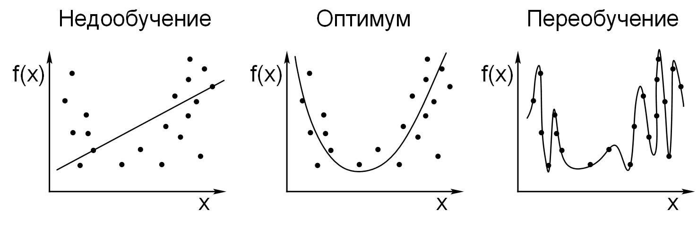
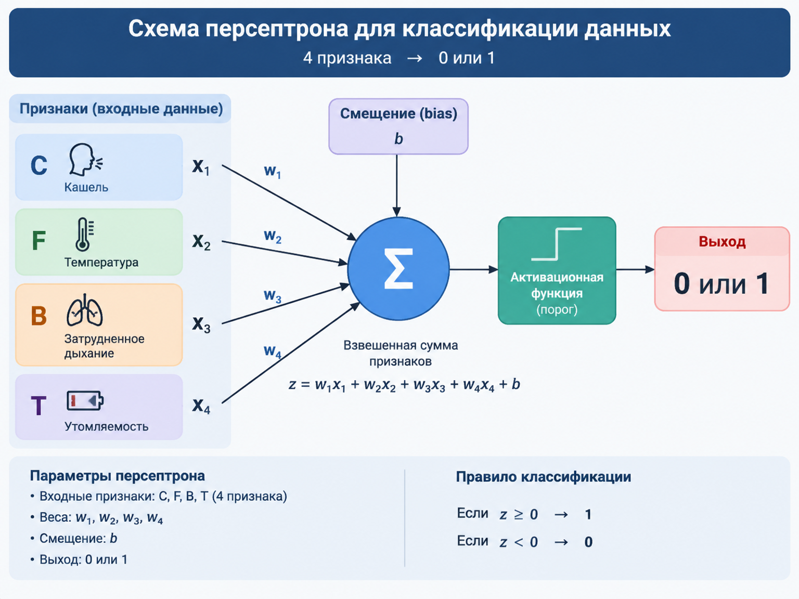

# Луис Серрано - Грокаем машинное обучение

[Официальный сайт](https://www.serrano.academy/) Серрано.

Сайт книги от [издательства Manning](https://www.manning.com/books/grokking-machine-learning)

Материалы книги: [www.github.com/luisguiserrano/manning](https://github.com/luisguiserrano/manning)

## Терминология

- Признаки - свойства, или характеристики данных. Если данные содержаться в таблице, то признаками являются столбцы таблицы
- Метки - если мы хотим спрогнозировать определённый признак на основе других, то этот признак является меткой
- Размеченные данные - поставляются с тэгом, или меткой (метка может быть как типом, так и числом)
- Неразмеченные данные - поставляются без меток
- Регрессионный модели - типы моделей, которые прогнозируют числовые данные.
- Классификационные модели - прогнозируют категориальные данные

Цель прогностической модели машинного обучения состоит в том, чтобы угадать метки в данных.

Размеченные и неразмеченные данные дают две ветки машинного обучения - контролируемой и неконтролируемой.

Числа и состояния (например: "собака/кошка/птица", "мужчина/женщина") - это два типа данных, используемых в моделях контролируемого обучения. Первый тип называется числовыми данными, а второй - **категориальными**.

## Математические выражения

P(A|B) означает, что: "вероятность того, что событие A произойдёт, с учётом того, что другое событие B, уже произошло". Например, ели А представляет собой сегодняшний день, а В - жизнь в трочиеском лесу Амазонн, то формула `P(A|B) = 0.8` попросту означает: "Вероятность того, что сегодня пойдёт дождь, уичтывая, что мы живём в тропическом лесу Амазонн, составляет 80%".

## Модели контролируемого обучения

**Регрессионная модель** - модель прогнозирования цен на жильё. Каждая точка данных представляет собой дом. Метка каждого дома - это его цена. Наша цель добиться того, чтобы, когда на рынке появится новый дом, мы могли бы спрогнозировать его метку, то есть цену.

В примере с жильём признаками могут быть любые характеристики, описывающие дом: размер, количество комнат, расстояние до ближайшей школы или уровень преступности в районе.

Наиболее распространённым методом регрессии выступает **линейная регрессия**. Другими популярными метода, с помощью которых выполняется регрессия, выступают регрессия дерева решений, а также несколько методов ансамбля, таких как случайные леса, AdaBoost, деревья с градиентным усилением и XGBoost.

**Классификационная модель** - модель обнаружения спама в электронной почте. Каждая точка данных представляет собой электронное письмо. Метка каждого из них - является ли оно спамом. Наша цель в том, чтобы при поступлении нового электронного письма (точки данных) мы могли спрогнозировать его метку, а именно, является ли оно спамом.

## Алгоритмы неконтролируемого обучения

Способны группировать похожие элементы. Например, рассортировать изображения на кошечек и собачек.

Основные направления неконтролируемого обучения:

- Алгоритмы кластеризации
- Алгоритмы понижения размерности
- Генеративные алгоритмы

Алгоритмы не контролируемого обучения:

- **Кластеризация К-средних**. Алгоритм группирует точки, выбирая некоторые случайные центры масс и перемещая их все ближе и ближе к точкам, пока они не окажутся в нужных местах
- **Иерархическая кластеризация**. Алгоритм начинается с группировки ближайших точек и продолжает работу, пока не получиться несколько чётко определённых групп
- **Пространственная кластеризация на основе плотности (DBSCAN)**, Это алгоритм начинает группировать точки в местах с высокой плотностью, помечая изолированные точки как шум
- **Гауссовы модели смешения**. Алгоритм не присвает точки одному кластеру, а присваивает доли точки каждому из существующих кластеров

Процесс называется "понижением размерности", т.к. каждый столбец в наборе данных представляется _измерением_. Если у нас есть 50 полей, то элемент размещается в 50-мерном пространстве. Если нам удасться умешьнить количество признаков, то мы снизим размерность.

Для распространённых способа снижения размерности матрицы - разложение матрица на множители и разложение по сингулярным значениям. Оба алгоритма преобразуют большую матрицу данных в произведение меньших матриц.

Область генеративного обучения состоит из моделей, которые, учитывая набор данных, могут выводить новые точки данных, выглядящие как образцы из исходного набора. Алгоритмы:

- GAN, разработан Яном Гудфеллоу с соавторами
- вариационные автокодеры, созданные Кингмой и Веллингом
- ограниченные машины Больцмана (RBMs), разработанные Джеффри Хинтоном

## Прямая вплотную к точкам. Линейная регрессия

Цель линейной регрессии состоит в том, чтобы построить прямую, проходящую как можно ближе к этим точкам.

Материалы к главе: https://github.com/luisguiserrano/manning/tree/master/Chapter_03_Linear_Regression

Снова терминология:

- МЕТКА - это цель, которую мы пытаемся предсказать по признакам
- МОДЕЛЬ машинного обучения - правило или формула, которая предсказывает метку на основе признаков
- ПРОГНОЗИРОВАНИЕ - резльтат работы модели
- ВЕСА - В формуле соответствующей модели, каждый признак умножается на коэффициент. Эти факторы являются весовыми коэффициентами
- СМЕЩЕНИЕ - формула, соответствующая модели, содержит константу, которая не привязана ни к одному из признаков. Эта константа называется смещением
- СКОРОСТЬ ОБУЧЕНИЯ - очень маленькое число, которые мы выбираем перед обучением модели. Оно помогает убедиться, что модель при обучении меняется по чуть-чуть. Часто обозначается как  `η` (эта).

Довольно часто в книгах с описанием регрессии используется символ $\hat{p}$ - `p̂`

Квадратический подход - отличный способ приблизить приямую к одной из точек.

### Функция ошибок

Для оценки качестве регрессии часто используется **функция ошибок**. Это показатель, который сообщает насколько хорошо работает модель. Часто этот показатель называют **функцией потерь**, или **функцией затрат**.

Есть два распространённых способа определить хорошую функцию ошибок для моделей линейной регрессии - вычисление абсолютной погрешности и квадратической погрешности. Абсолютная погрешность - сумма вертикальных расстояний от прямой до точек в наборе данных, а квадратическая погрешность - сумма квадратов эти расстояний.

Квадратическая погрешность очень похожа на абсолютную, за исключением того, что вместо взятия абсолютного значения разницы между меткой и предсказанной меткой мы берём его квадрат. Это всегда превращает число в положительное.

На практике, гораздо чаще используется средняя квадратическая погрешность. Отличие от квадратической погрешности состоит в том, что мы берём среднее значение квадратов.

Ещё одна погрешность -  RMSE - квадратичный корень из средней квадратической ошибки. Когда мы возводим в квадрат, например, отклонение цены, то можем получить "рубль в квадрате". "Квадратный рубль" не является единицей измерения. К тому же, если мы оперируем обычными, не квадратичными значениями, то легче представляем меру отклонения: "5 рублей" звучет более понятно, чем "квадрат цены в 25 рублей".

### Градиентный спуск. Как уменьшить функцию ошибок, медленно спускаясь с горы

Способ спуска с "горы в тумане". Изучить все направления, в которых можно сделать один шаг, и выяснить, каое направление помогает спуститься ниже свего. Делаем маленький шаг в направлении наибольшего спуска и повторяем процесс до тех пор, пока не спустимся с горы.

У подхода есть множество "подводных камней". Например, мы можем достигнуть как подножия горы, так и долины из который мы не сможем выбраться по приведённому выше алгоритму. Однако есть трюки, которые позволяют снизить вероятность возникновения ошибок.

Градиентный списка работает для разных видов машинного обучения, включая линейную регрессию.

На практике часто строять график функции ошибок, который помогает понять, что система уже достаточно обучилась и новые итерации не улучшают функцию ошибки.

Иногда данных слишком много и использовать все данные для выполнения линейной регрессии - избыточно. Использование всего набора данных называется **пакетным градиентным спуском**, а частичное использование данных - **мини-пакетным градиентным спуском**.

[Turi Create](https://pypi.org/project/turicreate/) - популярный пакеты, в котором реализованы многие алгоритмы машинного обучения.

>На [сайте GitHub](https://github.com/apple/turicreate/) написано, что репозитарий был заархивирован пользователем 21 декабря 2023 года. И теперь этот репозитарий только для чтения. Дальнейшие перспективы пакета неопределены.

Загрузка данных из CSV-файла выглядит так:

```csharp
import turicreate as tc

data = tc.SFrame('Hyderabad.csv')
```

Обучение модели линейной регрессии требует всего одной строки кода:

```py
model = tc.linear_regression.create(data, target='Price')
```

Для прогнозирования используется метод `predict()`:

```py
house = ts.SFrame({'Area': [1000], 'No. of Bedrooms': [3]})
model.predict(house)
```

### Полиноминальная регрессия

Эффективным расширением линейной регрессии является **полиноминальная регрессия**.

Многочлены - это класс функций, полезных при моделировании нелинейных данных.

Параметры и гиперпараметры - одни из наиболее важных понятий в машинном обучении. Регрессионные модели определяются их весами и смещением - параметрами модели. Однако перед обучением модели мы может настроить "другие ручки", такие как скорость обучения, количество периодов, степень (для полиноминальной регрессии). Они называются - гиперпараметрами. Т.е.:

- любая величина, которую вы устанавливаете перед процессом обучения - это гиперпараметр
- любая величина, которую модель создаёт или изменяет в процессе обучения - это параметр

## Недообучение/Переобучение

В машинном обучении **недообучение** очень похоже на недостаточную подготовку к экзамену. **Переобучение**, в свою очередь, напоминает заучивание всего учебника вместо подготовки к экзамену.

Настоящая проблема с переобучением заключается в том, чтобы заставить модель делать прогнозы на основе новых данных.

Иллюстрация недообучение (левый график) и переобучения (правый график):



Картинка взята из публично доступных материалов Яндекс.

Один из способов определить, подходит ли модель - протестировать её.

Мы не используем все точки для обучения - некоторую часть мы отбираем и используем для тестирования эффективности модели. Такой набор точек называется **тестовым набором**. Точки используемые для обучения называются **обучающим набором**.

Переобученная модель даёт большую погрешность тестирования. Благодаря этому мы можем понять, что модель переобучена.

На практике, любое значени от 10% до 20% тестового набора работает более, или менее хорошо.

ЗОЛОТОЕ ПРАВИЛО: никогда не применяйте для обучения тестовые данные.

В действительности, набор данных нужно разбить не на две, а на три части:

- **обучающий набор** для обучения всех наших моделей
- **контрольный набор** для принятия решений о том, какую модель использовать
- **тестовый набор** для проверки того, насколько хорошо модель справилась

Обычно используются распределения 60-20-20, или 80-10-10.

### График сложности модели

График сложности модели помогает выбрать модель. Под выбором модели имеется ввиду - какую степень модели из числе от 0 до 10 (или больше) мы хотим выбрать для нашей полиноминальной модели. На графике ось X соответствует степени полинома, а ось Y - ошибка (средняя абсолютная ошибка). На графике мы отображаем как ошибку обучения, так и ошибку валидации и выбираем степень полинома таким образом, чтобы сумма обоих ошибок была минимальной.

Ещё один способ избержать переобучения - регуляризация. 

Оценка сложности модели может быть осуществлена с использованием норм L1 и L2:

- L1: сумма абсолютных значений коэффициентов
- L2: сумма квадратов коэффициентов

Пример L1:

```
y = x^9 + 4x^8 - 9x^7 + 3x^6 - 14x^5 - 2x^4 - 9x^3 + x^2 + 6x + 10
```

Т.е.:

```
y = |1| + |4| + |-9| + |3| + |-14| + |-2| + |-9| + |1| + |6| = 49
```

Они вытекают из общей теории LP-пространств, называнной в честь французского математика Анри Лебега.

Предположим, что у нас есть две модели с которые отличаются степенью полинома и коэффициентами. Сумма модулей/квадратов коэффициентов даёт значение, которое используется для оценки сложности. Чем большим является значение, тем более сложным является модель.

Для модели у нас есть две меры: мера производительности (функция ошибок) и мера сложности (норма L1 или L2).

ОШИБКА РЕГРЕССИИ - показатель качества модели.

СЛАГАЕМОЕ РЕГУЛЯРИЗАЦИИ - мера сложности модели. Это может быть норма L1 или L2 модели.

Величина, которую мы хотим свести к минимуму, чтобы найти хорошую и не слишком сложную модель, - это модифицированная ошибка, определяемая как сумма двух слагаемых:

```
ошибка = ошибка регрессии + слагаемое регуляризации
```

Регуляризация настольно распространена, что сами модели имеют разные названия в зависимости от того, какая норма испольузется. Если мы обучаем регрессионную модель с помощью нормы L1, эта модель называется **регрессией лассо**. LASSO = _lease absolute shrinkage and selection operator_.

Существует понятие **параметр регуляризации**, который определяет должен ли процесс обучения модели описаться на производителность, или простоту. Параметр регуляризации обозначается как λ

Мы умножаем слагаемое регуляризации на λ, добавляем его к ошибке регерссии и используем результат для обучения модели.

Очень важно выбрать хорошее значение λ. Обычно выбираются степени 10, такие как 10; 1; 0,1; 0,01:

В зависимости от того, какой тип модели нам нужен, выбор между применением регуляризации L1 и L2 может оказаться решающим.

- регуляризация L1 рекомендуется, когда набор данных содержит много признаков и мы зотим свести многие из них к нулю
- регуляризацию L2 стоит применять, когда признаков в наборе данных мало и мы хотим сделать их маленькими, но не равными нулю

Пытаясь понять, как работает модель машинного обучения, мы должны смотреть дальше функции ошибок. Функция ошибки говорит: "это ошибка, и если вы уменьшите её, то в итоге получите хорошую модель". Но это всё равно, что сказать: "секрет успеха в жизни заключается в том, чтобы совершать как можно меньше ошибок".

## Что такое классификация

Модели классификации аналогичны регрессионным моделям в том смысле, что их целью является прогнозирование меток набора данных на основе признаков.

Регрессионные модели нацелены на **предсказания числа**, а классификационные - на **предсказание состояния или категориии**.

Существуют классификаторы, которые учитывают порядок слов и другие элементы, такие как знаки преписания или идиомы. Без этого невозможно было бы, например, сделать классификатор по эмоциям в тексте. Есть два предложения: "Мне не грустно, я счастлив" и "Я не счастлив, мне грустно" - слова те же самые, но значение предложений разное. С последовательными данными работают такие модели как: скрытые марковские модели, рекуррентные нейронные сети, или сети долгвременной кратковременной памяти (LSTM).

## Упражнения к главе №5

Задача на разработку персептрона для классификации данных.



Таблицу для упражнения №5.1 **Алиса Про** распознала следующим образом:

```py
import numpy as np

# Признаки: C (кашель), F (температура), B (затрудненное дыхание), T (утомляемость)
# 1 — признак присутствует (X), 0 — отсутствует
X = np.array([
    [0, 1, 1, 1],  # Пациент 1
    [1, 1, 0, 1],  # Пациент 2
    [1, 0, 1, 1],  # Пациент 3
    [1, 1, 1, 0],  # Пациент 4
    [1, 0, 0, 1],  # Пациент 5
    [0, 1, 1, 0],  # Пациент 6
    [0, 1, 0, 0],  # Пациент 7
    [0, 0, 0, 1]   # Пациент 8
])

# Целевая переменная: 1 — болен, 0 — здоров
y = np.array([1, 1, 1, 1, 0, 0, 0, 0])
```

Gemma 4 предложила следующее решение:

```py
import numpy as np

# ------------------
# ВХОДНЫЕ ДАННЫЕ
# ------------------
# Признаки: C, F, B, T
X = np.array([
    [0, 1, 1, 1],  # Пациент 1
    [1, 1, 0, 1],  # Пациент 2
    [1, 0, 1, 1],  # Пациент 3
    [1, 1, 1, 0],  # Пациент 4
    [1, 0, 0, 1],  # Пациент 5
    [0, 1, 1, 0],  # Пациент 6
    [0, 1, 0, 0],  # Пациент 7
    [0, 0, 0, 1]   # Пациент 8
])

# Целевая переменная: 1 — болен, 0 — здоров
y = np.array([1, 1, 1, 1, 0, 0, 0, 0])


class Perceptron:
    """
    Класс реализации модели Персептрона для бинарной классификации.
    """
    def __init__(self, learning_rate=0.1, epochs=100):
        # Скорость обучения (eta)
        self.lr = learning_rate
        # Количество эпох (полных проходов через весь набор данных)
        self.epochs = epochs
        self.weights = None
        self.bias = None

    def predict_activation(self, X_sample):
        """
        Вычисляет взвешенную сумму (z = w * x + b)
        и применяет пороговую функцию.
        """
        # Взвешенная сумма
        activation = np.dot(X_sample, self.weights) + self.bias
        
        # Ступенчатая функция (Порог 0.5)
        # Если сумма >= 0, выходим 1 (положительная класс)
        # Иначе выходим 0 (отрицательный класс)
        return np.where(activation >= 0, 1, 0)

    def fit(self, X, y):
        """
        Обучает модель Персептрона.
        """
        n_samples, n_features = X.shape
        
        # 1. Инициализация весов и смещения (обычно нулями)
        self.weights = np.zeros(n_features)
        self.bias = 0

        # 2. Главный цикл обучения (Эпохи)
        print(f"--- Начало обучения Персептрона ({self.epochs} эпох) ---")
        
        for epoch in range(self.epochs):
            errors = 0
            # Проход по всем образцам данных
            for i in range(n_samples):
                x_sample = X[i]
                true_label = y[i]
                
                # 3. Предсказание
                prediction = self.predict_activation(x_sample)
                
                # 4. Вычисление ошибки
                error = true_label - prediction
                
                # Если ошибка не ноль, обновляем веса
                if error != 0:
                    # 5. Обновление весов: w = w + eta * error * x
                    self.weights += self.lr * error * x_sample
                    
                    # 5. Обновление смещения: b = b + eta * error
                    self.bias += self.lr * error
                    
                    errors += 1
            
            # Вывод статистики (показывает, сколько раз произошла ошибка)
            if errors == 0:
                print(f"\n✅ Конвергенция достигнута на эпохе {epoch + 1}!")
                break
            # else:
            #     print(f"Эпоха {epoch+1}: Обновлено весов {errors} раз.")

    def predict(self, X_test):
        """
        Делает предсказание для набора тестовых данных.
        """
        predictions = []
        for x_sample in X_test:
            prediction = self.predict_activation(x_sample)
            predictions.append(prediction)
        return np.array(predictions)

# =================================================
# ЗАПУСК МОДЕЛИ
# =================================================

# 1. Создание и обучение модели
# Используем более низкий Learning Rate и больше эпох для стабильности
model = Perceptron(learning_rate=0.1, epochs=100)
model.fit(X, y)

# 2. Проверка результатов на тех же данных (тестирование)
predictions = model.predict(X)

# 3. Вывод результатов
print("\n" + "="*50)
print("           РЕЗУЛЬТАТЫ КЛАССИФИКАЦИИ")
print("="*50)

# Обновляем заголовки для наглядности
headers = ["Пациент", "C", "F", "B", "T", "Истинный класс (y)", "Предсказание (y_hat)"]

print(f"{headers[0]:<10}", end="")
for i in range(1, 5):
    print(f" {headers[i]:<4}", end="")
print(f" {headers[5]:<20}", end="")
print(f" {headers[6]:<10}")
print("-" * 110)


for i in range(len(X)):
    # Форматирование вывода
    feature_str = " | ".join(map(str, X[i]))
    print(f"{i+1:<10} {feature_str:<4} {y[i]:<20} {predictions[i]:<10}")

# 4. Расчет метрик
accuracy = np.mean(predictions == y) * 100
print("\n" + "="*50)
print(f"Общая точность (Accuracy) на обучающем наборе: {accuracy:.2f}%")
print("="*50)
```

Таким образом получается, что задача была на подготовку персептрона для классификации данных, без использования вспомогательных библиотек, используя только голые вычисления.

Результат тестового прогона:

```
--- Начало обучения Персептрона (100 эпох) ---

✅ Конвергенция достигнута на эпохе 20!

==================================================
           РЕЗУЛЬТАТЫ КЛАССИФИКАЦИИ
==================================================
Пациент    C    F    B    T    Истинный класс (y)   Предсказание (y_hat)
--------------------------------------------------------------------------------------------------------------
1          0 | 1 | 1 | 1 1                    1         
2          1 | 1 | 0 | 1 1                    1         
3          1 | 0 | 1 | 1 1                    1         
4          1 | 1 | 1 | 0 1                    1         
5          1 | 0 | 0 | 1 0                    0         
6          0 | 1 | 1 | 0 0                    0         
7          0 | 1 | 0 | 0 0                    0         
8          0 | 0 | 0 | 1 0                    0         

==================================================
Общая точность (Accuracy) на обучающем наборе: 100.00%
==================================================
```

Функция обучения fit(), организует цикл на максимум 100 эпох (_epoch_). В каждой эпохе организуется цикл по доступным признакам (X).

Для каждого признака вычисляется "взвешенная сумма" - отпределяется относится ли признак к классу "положительный", или "отрицательный". Веса корректируем только в том случае, если результат не соответствует значению метки для данной строки набора, т.е. если модель ошибочна.

Если в течение эпохи не было обнаружено ни одной ошибки (errors == 0), модель считается сошедшейся (конвергировавшей), и обучение прерывается, что экономит время.
